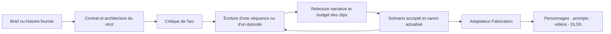

# Audit de la rédaction des histoires longues

20 septembre 2026 — proposition de trajectoire, sans implémentation du moteur.

Mise à jour après implémentation et retour utilisateur : le [cas Pomitto et les réglages conseillés](retour-pomitto-et-reglages-2026-09-20.md) montrent que le moteur court développe déjà efficacement une intention concrète. Conserver cette capacité, la simplicité d’usage et le point d’arrêt demandé devient un critère de la refonte. Le verdict ci-dessous porte sur l’architecture longue examinée initialement ; il ne démontre pas que toute la rédaction existante est mauvaise.

## Verdict

**Je recommande de remplacer le cœur éditorial du mode long par une V2 : contrat narratif, architecture du récit, écriture des séquences et contrôle sémantique. La chaîne de Fabrication constitue une bonne frontière à conserver.**

L'existant sait déjà préparer une série, attribuer des identités stables et produire des scènes exploitables. Sa faiblesse est de faire tenir une intention narrative dans des cases de production avant d'avoir suffisamment défini les causes, les règles du monde, les connaissances des personnages et les révélations. Ajouter des consignes au même schéma peut améliorer un cas, mais ne suffit pas à organiser plusieurs minutes de récit.

Les références justifient plusieurs **profils de narration partageant le même moteur**, avec une distinction entre récit continu et feuilleton. « Fruits », le registre des dialogues et l'apparence des personnages doivent rester des choix indépendants de la mécanique de l'histoire.

## 1. Périmètre et preuves

- Code actif inspecté : `D:\Code\panelforge-krea2-flux`, branche `feature/vocal-normalizer-dialogue-register`, HEAD constaté en fin d'inspection `8c8257e`. Le dossier `D:\Code\panelforge` est un checkout plus ancien, mais contient les données utilisées.
- Données : 33 projets dans `D:\Code\panelforge\workspace\stories`, dont **quatre projets longs, trois arcs enregistrés et trois épisodes 1 développés**. Aucun de ces projets n'a encore d'épisode 2 développé. Cela permet un diagnostic de conception et des ouvertures, pas une mesure de qualité sur une série terminée.
- Sources : les cinq MP4 fournis, les deux textes collés et `audit_moteur_histoires.md`. Les recommandations de ces documents sont des opinions examinées, pas des instructions exécutées.
- Vidéos : durées mesurées avec FFprobe ; inspection par images horodatées, toutes les 2 à 4 secondes pour les extraits courts et toutes les 12 secondes pour le fichier de 6 min 30. Transcription locale CPU des quatre références, confrontée aux images et aux analyses jointes. Les erreurs de transcription et les transitions entre images échantillonnées limitent la précision ; ce n'est pas une écoute critique du mixage ni une analyse exhaustive de chaque plan.
- Traces : prompts réellement envoyés pour Kiwina et Pomitta, distincts des prompts présents aujourd'hui dans le code. Aucun nouvel appel au LLM de PanelForge, aucun rendu et aucun redémarrage n'ont été lancés. Les tests ont été lus, pas exécutés.

Les planches, mesures et transcriptions sont conservées hors des sources dans `D:\Code\panelforge\workspace\experiments\audit-stories-2026-09-20`.

**Deux rectifications importantes par rapport aux analyses jointes :**

1. `La vengeance salée de Pomitto` est enregistrée avec `narrative_format: short`. Son problème illustre les biais des prompts partagés, mais ne démontre pas à lui seul une défaillance de la mémoire du mode long.
2. Kiwina, Pomitta et Nour ont été écrits avant le dernier correctif du prompt d'arc long. Les traces Kiwina/Pomitta ne contiennent pas le nouveau bloc `ARC LONG UNIQUEMENT`. Le code actuel corrige déjà certaines causes historiques ; son gain qualitatif n'est pas encore démontré par ces sorties.

## 2. Ce que les références demandent au constructeur

| Référence | Durée mesurée | Mécanique observée | Besoin du moteur |
|---|---:|---|---|
| `AQO__Lhtt…mp4` | 47,81 s | Soins, dévouement domestique, complicité amoureuse cachée, boisson suspecte, secours et nouvelle union. L'image du couple initial est renversée par ses actes. | Intentions divergentes, continuité d'un objet décisif, ellipses entre les lieux, possibilité d'une conclusion cruelle. |
| `Download(27).mp4` — Kiwina | 28,20 s | Exclusion, contestation, invention, reconnaissance. | Relier la reconnaissance à une démonstration compréhensible et à un objectif précis. Exemple diagnostique, sans réécriture demandée. |
| `snaptik_7640198625003425057_v3.mp4` — pomme/sirène | 62,97 s | Blessure initiale, chute, deux découvertes, secours, acquisition de pouvoirs, départ vers un nouvel objectif. | Préserver les découvertes et la progression émotionnelle ; distinguer transformation accomplie et vengeance encore promise. |
| `snaptik_7682334544095169825_v3.mp4` — Chloé/Lucas | 72,97 s | Une interaction présentée comme un jeu prend un sens inquiétant après une information tardive ; fin sur le danger. | Distinguer ce que savent l'enfant, l'autre personnage, les parents et le spectateur. Autoriser l'information différée. |
| `snaptik_7683245244187446560_v3.mp4` — compteurs | 390,20 s | Urgence, refus, acte irréversible, ressource nouvelle, dissimulation, convoitise, police et fuite. | Règles persistantes, conséquences différées, buts successifs et renouvellement des obstacles sur plusieurs séquences. |

Les cinq fichiers ne valident pas une formule unique « humiliation → preuve → victoire ». Dans AQO, le personnage aidé peut trahir la personne qui l'aide. Dans Chloé, l'intérêt vient d'une compréhension retardée. Dans les compteurs, résoudre un danger en crée d'autres. Dans la pomme, **la fin réussit un changement de statut sans accomplir la vengeance**.

Le fichier Kiwina est un épisode/extrait, pas une série complète. Son scénario enregistré prévoit 4 × 10 s, tandis que le MP4 fourni dure 28,20 s ; les éléments inspectés ne suffisent pas à attribuer cet écart au montage ou à la génération. Les comparaisons futures devront contrôler la durée effectivement présentée.

Il ne faut donc pas imposer une victoire méritée, une preuve judiciaire ou un antagoniste humain à chaque récit. Il faut exiger que les changements importants soient compréhensibles selon le genre choisi. Une découverte, une erreur, une catastrophe ou une tentative ratée peuvent porter une séquence.

Les références restent imparfaites : attribution commode de pouvoirs, règles parfois flottantes, longue poursuite, informations rapportées tardivement. Ce sont des exemples de mécanismes désirés, pas des scénarios à recopier ni des preuves de rétention.

## 3. Fonctionnement actuel du mode long

Le parcours est : **brief → propositions → sélection → arc de quatre épisodes → sélection et format d'un épisode → scénario en micro-scènes → Fabrication**.

Sans révision ni relance, cela représente deux appels communs — propositions et arc — puis un appel par épisode. Une série complète de quatre épisodes représente donc six appels narratifs, avant la préparation des images et vidéos.

Le mode long possède déjà :

- une bible de personnages et une promesse globale ;
- pour chaque épisode : promesse, conflit, 2 à 6 beats, payoff local, ouverture, état final et transmission au suivant ;
- une mémoire compacte des scénarios précédemment écrits ;
- des identifiants récurrents contrôlés, des versions récupérables, des traces et des brouillons refusés conservés ;
- une séparation entre scénario et caméra ;
- une Fabrication indépendante par épisode, avec héritage des images de personnages.

Ces éléments ont une valeur réelle. La refonte doit remplacer leur sémantique insuffisante sans jeter leur persistance et leur intégration.

Sources : [contrat de l'arc](../../src/panelforge/domain/stories.py#L349), [mémoire](../../src/panelforge/application/stories.py#L344), [construction des requêtes](../../src/panelforge/application/stories.py#L553), [entrée Fabrication](../../src/panelforge/domain/episodes.py#L112).

## 4. Limites encore présentes dans le code

### P0 — Le format technique décide trop tôt du récit

`SERIES_EPISODE_COUNT = 4` est partagé par contrat, service et interface. Le mode long n'accepte que l'exploration de propositions : un script long fourni ne peut pas utiliser le parcours fidèle. Chaque épisode impose 1 à 12 micro-scènes de même durée, entre 5 et 15 secondes. Le validateur refuse un nombre différent.

Surtout, le prompt dit que ce nombre est obligatoire « même si le contenu doit être regroupé ou densifié ». Une consigne voisine exige de conserver toutes les actions indispensables. Le modèle doit résoudre cette tension en comprimant, en inventant des raccords ou en simplifiant l'histoire.

L'arc est calibré avec le format initial, mais le format d'un épisode peut ensuite changer avant sa rédaction sans nouvelle vérification de l'architecture. Il n'existe pas de distinction formelle entre **séquence dramatique, scène dans un lieu et clip généré**.

**Direction :** durée et coût deviennent des budgets négociables ; le nombre de clips découle du récit retenu. Si le budget est fixe, réduire explicitement le périmètre de l'épisode ou déplacer un événement, plutôt que tout faire entrer implicitement. Conserver un mode de production à durée uniforme est possible, après cette décision.

Sources : [constantes](../../src/panelforge/domain/stories.py#L29), [choix de format](../../src/panelforge/application/stories.py#L399), [densification imposée](../../src/panelforge/application/stories.py#L697), [nombre exact](../../src/panelforge/domain/stories.py#L668).

### P0 — Le long hérite d'un moule de mélodrame court

Les propositions Fruit demandent protagoniste, antagoniste, escalade, révélation et fin accomplie. Le long part ensuite de ce concept. L'arc possède désormais son propre prompt, mais son développement utilise encore la recette de scénario de la famille, enrichie de règles longues.

Les recettes actuelles mélangent plusieurs axes : univers de fruits, ton mélodramatique, personnages adultes, niveau d'explicite, comédie de couple ou absence de parole. Elles ne constituent pas un catalogue de structures narratives indépendantes.

**Direction :** séparer univers visuel, profil narratif, mode de narration et forme de diffusion. Garder un seul service et des contrats partagés, avec des exigences propres à chaque profil.

Sources : [familles actuelles](../../src/panelforge/domain/stories.py#L98), [propositions r3](../../prompt_sources/story.brainrot/1.0.0/editorial-r3/concepts.txt), [sélection du prompt](../../src/panelforge/application/stories.py#L674).

### P0 — La causalité est demandée, mais peu représentée et peu contrôlée

Les beats sont des chaînes de texte. Désir, choix, règles, preuves et causalité peuvent figurer dans la prose, mais aucun lien explicite ne permet de vérifier qu'une capacité utilisée a été préparée ou qu'une récompense correspond au but annoncé.

`opening_state`, `action` et `ending_state` sont utiles. Ils autorisent néanmoins une action banale suivie d'un état final déclarant une grande victoire. `visual_transition` est un bon précédent structuré pour les transformations ; il ne couvre pas toutes les informations, décisions et conséquences narratives.

Les diagnostics comptent principalement les mots de dialogue, les références et les éléments inutilisés. Ils ne recherchent pas le maillon causal manquant ou le résultat seulement proclamé. La révision est demandée par l'auteur ; il n'y a pas de critique sémantique distincte avant Fabrication.

**Direction :** représenter les changements décisifs, leur cause et leur manifestation à l'écran ou dans le son. Faire relire le récit à une étape séparée qui cite les passages et propose une correction ciblée. Ne pas transformer une appréciation subjective en validateur déterministe prétendument infaillible.

Sources : [scénario accepté](../../src/panelforge/domain/stories.py#L576), [diagnostics](../../src/panelforge/domain/stories.py#L777), [opérations disponibles](../../src/panelforge/application/stories.py#L465).

### P0 — Secrets et révélations futures ne sont pas protégés

Le writer reçoit l'épisode sélectionné et le passé compact. Les autres fiches d'épisodes sont retirées, mais la fin globale et les descriptions de personnages demeurent accessibles. Il reçoit l'ordre de ne pas anticiper les payoffs suivants sans disposer d'un registre explicite de ce qui leur est réservé.

Un résumé global ne suffit pas à distinguer : vérité du monde, croyance d'un personnage, information connue du public et révélation autorisée maintenant. Un writer peut expliquer trop tôt un secret ou utiliser une ressource future, tout en conservant noms et continuité matérielle.

**Direction :** transmettre une carte compacte du futur réservé et des connaissances utiles à l'épisode, avec des événements identifiés. Le but n'est pas de cacher l'intrigue au writer, mais de lui indiquer précisément ce qu'il doit cacher au public.

Source : [projection de l'arc au writer](../../src/panelforge/application/stories.py#L653).

### P1 — Certaines règles actuelles pénaliseraient le suspense

Le nouveau prompt demande de montrer les incidents causaux indispensables et de ne jamais commencer après eux s'ils ne figurent pas dans les épisodes précédents. Cela aide une intrigue auparavant incompréhensible. Appliqué littéralement à tous les genres, cela empêche un vol hors champ à élucider, une intention cachée ou une révélation ultérieure.

De même, accomplir un payoff local est une bonne exigence, mais « local » doit être choisi : découverte d'une piste, survie provisoire, acquisition d'un pouvoir, décision irréversible. Ce n'est pas nécessairement la résolution du conflit global. **Les prompts r3 permettent déjà le suspense : ils n'ordonnent pas de conclure toute intrigue. Leur faiblesse est de ne pas formaliser cette distinction.**

**Direction :** distinguer une ellipse involontaire qui rend l'action incompréhensible d'une information volontairement retenue. Déclarer le type de fin et ce qu'elle résout réellement.

Source : [prompt long actuel](../../src/panelforge/application/stories.py#L163).

### P1 — La mémoire ne constitue pas encore un canon de série fiable

`_series_history` reprend logline, descriptions et états finaux, ces derniers tronqués à 800 caractères par scène. Ce sont les faits déclarés par le scénario, **pas des événements vérifiés dans les vidéos**. Les actions, dialogues, règles et connaissances ne sont pas conservés séparément.

Un épisode antérieur non écrit est simplement ignoré dans cette mémoire. Modifier un épisode ou l'arc ne marque pas les épisodes suivants comme à recontrôler. La validation du casting protège les couples ID/nom ; elle ne vérifie pas l'évolution des motivations, relations, objets ou pouvoirs.

**Direction :** un canon structuré, dérivé des documents narratifs acceptés, avec provenance et dépendances. Une correction signale les épisodes et préparations affectés, sans effacer les rendus ni les régénérer automatiquement. Un épisode hors ordre peut exister comme brouillon, mais ne doit pas être présenté comme compatible avec un passé qui n'a pas encore été fixé.

Sources : [mémoire et casting](../../src/panelforge/application/stories.py#L344), [édition](../../src/panelforge/application/stories.py#L423), [application d'un nouvel arc](../../src/panelforge/application/stories.py#L796).

### P1 — Le contrat audio est utile, mais trop lié à la famille Fruit

La compréhension par les paroles est un choix cohérent pour les références pomme et compteurs. Aujourd'hui, chaque micro-scène Fruit impose 1 à 4 entrées de dialogue et les paroles doivent porter toute causalité indispensable.

Cela peut encourager les explications répétées et supprimer des respirations. Ce serait particulièrement contraignant pour le suspense ou une histoire principalement visuelle comme AQO. À l'inverse, retirer ce principe partout ferait perdre une propriété utile des vidéos cibles.

**Direction :** proposer narration explicite, dialogue dramatique ou narration visuelle comme choix indépendant. Évaluer la compréhension audio à l'échelle d'une séquence, avec des clips silencieux possibles. Dans le suspense, l'audio doit rendre claire la situation présente sans nécessairement révéler l'intention cachée.

Source : [contrat audio-first](../../src/panelforge/application/stories.py#L80).

### P1 — L'éditorial long est partiellement hors des recettes versionnées

Le prompt d'arc spécialisé est construit en Python et remplace `plan.system` pendant cette étape. Les règles de format, mémoire et audio sont également ajoutées par le service. La trace garde le prompt effectif, ce qui est précieux ; la seule révision éditoriale `3` ne décrit cependant pas tout le comportement effectif du mode long.

**Direction :** une recette longue V2 versionnée pour chaque étape éditoriale, un assembleur de contexte séparé et des validateurs métier explicites. Conserver un manifeste du schéma, des prompts et des modèles réellement utilisés. Éviter une nouvelle accumulation de conditions dans `_request`.

Sources : [prompt spécialisé](../../src/panelforge/application/stories.py#L156), [assemblage final et trace](../../src/panelforge/application/stories.py#L728), [stockage des recettes](../../src/panelforge/infrastructure/storage/stories.py#L65).

## 5. Les sorties enregistrées confirment quoi ?

| Projet | Observation vérifiable | Lecture du problème |
|---|---|---|
| Kiwina, épisode 1 | L'arc pose déjà l'annonce sonore comme démonstration suffisante ; le scénario aboutit à la réinscription après les réactions admiratives. | La faiblesse existe avant le rendu. L'objet et la récompense manquent d'une relation suffisamment définie. |
| Pomitta, épisode 1 | Papier signé et menace préexistants ; dernier clip de 10 s avec confection d'une miniature, présentation, réaction et marché proposé. Ce clip comporte 37 mots de dialogue. | Injustices accumulées, événements présupposés et charge de production excessive ; un warning de dialogue existe déjà, sans contrôle de l'action. |
| Nour, arc | L'épisode 2 prévoit notamment la confection d'une robe et un numéro d'une minute, alors que son format est de 3 × 10 s. Plusieurs formulations mêlent français et anglais. | Le contrat de format ne vérifie pas la faisabilité narrative ni toute la qualité éditoriale. |
| Le secret du berceau citron | Propositions présentes, aucun arc ni épisode développé. | Pas de conclusion possible sur la tenue longue de cette intrigue. |

Ces observations portent sur des sorties historiques. Le correctif du 19 septembre cible explicitement plusieurs d'entre elles. Les limites structurelles de la section précédente restent visibles dans le code actuel ; il faut un essai contrôlé pour mesurer les progrès déjà apportés.

Fichiers inspectés : `story-66c09b0ce97046258bb2d2ff3529b8ea.json`, `story-c30532a3f1e2409388ffb6943eec013b.json`, `story-7390fe4513374825b903d2b9a43da9da.json`, `story-b63fb08d31d049c68ba08e123b2df6e5.json` sous le workspace principal.

## 6. Profils proposés

| Profil narratif | Ce qu'il doit organiser | Ce qu'il ne doit pas imposer |
|---|---|---|
| **Mélodrame / rapports de pouvoir** | Désirs opposés, lien affectif, tactiques, perte ou gain de pouvoir, conséquence émotionnelle. | Une victime toujours récompensée ou un antagoniste toujours puni. |
| **Transformation / quête** | État initial, découvertes, capacité acquise, essai, coût éventuel et nouvel objectif. | Une vengeance terminée dès l'acquisition du pouvoir. |
| **Suspense / révélation** | Vérité cachée, indices, croyances, information différée, relecture du début. | Tout expliquer ou tout montrer dès l'ouverture. |
| **Aventure à règle fantastique** | Règle simple, limites et exceptions préparées, ressource convoitée, conséquences et obstacles renouvelés. | Résoudre chaque difficulté en inventant un nouveau pouvoir. |

Ces profils peuvent se combiner, avec un profil dominant au départ. Ils partagent personnages, événements, mémoire, révisions, diagnostics et sortie Fabrication. Commencer par mélodrame et suspense permettra de vérifier que le moteur supporte deux besoins réellement différents ; transformation et règles fantastiques doivent néanmoins figurer dans le jeu d'évaluation dès le début.

Le format de diffusion reste séparé : **récit continu en séquences internes** ou **feuilleton en épisodes publiables**. Une séquence de récit continu n'a pas besoin d'une réintroduction et d'un cliffhanger artificiels. Un épisode publié doit offrir une progression propre et une raison de poursuivre. Le nombre quatre devient un preset éventuel.

## 7. Architecture cible et parcours proposé

**Le contrat protège le point de départ.** Il conserve la promesse, les événements obligatoires, les éléments libres, les révélations réservées, le type de fin et le budget. Une histoire déjà fournie doit pouvoir être structurée directement ; produire des propositions alternatives devient optionnel. Les ajouts qui changent son moteur doivent être visibles comme tels.

**L'architecture définit le trajet complet avant les dialogues.** Elle distingue arc global, unités dramatiques et épisodes éventuels. Pour chaque unité : question, état d'entrée, changement attendu, éléments préparés, type de sortie et conséquence transmise. Un payoff peut être une réponse partielle qui ouvre un problème plus important.

**Le canon sépare identité et évolution.** Il représente les règles du monde, les objets décisifs, leur détenteur, les relations, les capacités, les connaissances et les fils ouverts. Un changement de tenue ou de pouvoir ne crée pas une nouvelle identité. Chaque fait important renvoie à l'événement qui l'établit.

**L'écriture construit des scènes jouables.** Un événement décisif indique ce qui le provoque, la tentative ou découverte, ce qui change et comment le public le comprend. Les dialogues expriment une intention ; les réactions peuvent être silencieuses. On ne force pas un dilemme, une surprise ou une transformation dans chaque clip.

**La préparation en clips respecte le temps.** On estime séparément parole, actions successives et réactions, en tenant compte de leurs chevauchements possibles. Une durée estimée reste une estimation, pas une garantie. Un clip surchargé peut être scindé, son dialogue raccourci ou un événement reporté. La correspondance événements → clips reste traçable ; une scène dramatique peut occuper plusieurs clips.

Un contrat minimal pourrait ajouter, dans un document narratif séparé :

| Élément | Données nécessaires |
|---|---|
| Contrat de récit | `must_keep`, `freedoms`, `ending_type`, format de diffusion et budget |
| Événement | ID, dépendances, changement produit, manifestation visuelle/sonore |
| Information | Vérité, détenteurs de l'information, moment de révélation au public |
| Préparation/résolution | Événement préparatoire, utilisation prévue, état ouvert/résolu/abandonné |
| Révision | Sources acceptées, dépendances et éléments à recontrôler |

Ce tableau décrit des responsabilités, pas un gigantesque JSON à remplir à chaque appel. Le contexte d'un writer doit rester compact et limité aux faits utiles, aux règles applicables et au futur réservé.

### Nombre d'appels : ne pas conserver deux passes comme contrainte de principe

Point de départ proposé pour la V2 : un appel de contrat + architecture, une critique de l'arc, puis un appel de rédaction et une relecture par épisode ou séquence de travail. Cela fait **2 + 2N appels**, hors propositions optionnelles et corrections. Une correction motivée ajoute au maximum une tentative à l'étape concernée, puis revient à l'auteur si le problème persiste. Aucun cycle illimité.

L'allocation des événements aux clips est proposée pendant l'écriture, puis contrôlée à la relecture ; l'adaptateur technique reste déterministe. Si les essais montrent qu'un épisode ne tient pas dans un seul appel, on le découpe en séquences, sans envoyer tout le roman à chaque fois.

Ce budget est une hypothèse à mesurer, pas une obligation définitive. Le même modèle peut remplir plusieurs rôles avec des contextes distincts. Changer de modèle, ajouter des agents ou multiplier les variantes avant d'avoir un protocole d'évaluation ne constitue pas la priorité.

## 8. Préserver la Fabrication sans perdre les nouvelles informations

La sortie actuelle `characters / locations / scenes` est une frontière réutilisable. L'adaptateur V2 produit les champs déjà consommés : identités stables, état initial, action, dialogues attribués, état final et transformations éventuelles. Les preuves indispensables doivent se retrouver dans ces champs, pas seulement dans une annexe ignorée par les prompts vidéo.

Au début, les clips peuvent conserver une durée uniforme par épisode. Une durée variable exige une évolution explicite du pont : `initial_episode` assigne aujourd'hui `duration=clip_seconds` à toutes les scènes. Il serait trompeur de promettre des durées variables par un simple changement de prompt.

Autre contrat à traiter au pont : des compteurs ou textes décisifs doivent être rendus compréhensibles par un canal réellement supporté. L'export narratif ajoute actuellement « sans texte à l'écran ». Il faut choisir explicitement entre une information dite, un élément visuel fiable et une future incrustation, sans faire reposer le sens sur un texte que la production ne garantit pas.

Conserver : génération et sélection des personnages/décors, héritage des références, préparations H3/REF2V, files d'exécution, reprise, vidéos et DLSS. Les adaptations nécessaires concernent l'entrée de cette chaîne et la provenance, pas ses moteurs de rendu. Les nouveaux événements narratifs ne doivent pas introduire d'identifiants de nœuds ComfyUI dans le domaine.

Sources : [adaptation actuelle](../../src/panelforge/domain/episodes.py#L112), [héritage des images](../../src/panelforge/application/episodes.py#L54), [export d'intention](../../src/panelforge/domain/stories.py#L850).

## 9. Route de refonte proposée

| Étape | Livrable concret | Critère pour poursuivre |
|---|---|---|
| **1. Référentiel et frontière** | Petits briefs originaux représentant les quatre profils ; sorties actuelles conservées ; contrat d'entrée Fabrication figé. | On sait comparer sans changer modèle, style et production simultanément. |
| **2. Cœur narratif long V2** | Contrat, architecture, événements identifiés, connaissances, fils ouverts, critique avec passages cités. Premiers profils mélodrame et suspense. | Les scénarios se comprennent, préservent la promesse et réservent correctement leurs révélations. |
| **3. Écriture et continuité** | Scénarios par séquence/épisode, estimation temporelle, correction bornée, canon et dépendances de révision. | Au moins une histoire complète et plusieurs épisodes consécutifs restent cohérents après une modification amont. |
| **4. Raccord industriel et comparaison** | Adaptateur vers Fabrication, mêmes personnages/réglages, anciennes versions toujours relisibles. | Les informations narratives acceptées arrivent dans les intentions de scènes et les rendus peuvent être comparés. |

Utiliser un nouveau schéma et une recette longue V2, avec activation explicite. Les histoires courtes, recettes historiques, documents et rendus existants restent relisibles. Remplacer l'ancien parcours long pour les nouveaux projets seulement après comparaison ; ne pas migrer silencieusement les scénarios enregistrés.

### Évaluer le progrès

Préparer idéalement huit briefs, deux par profil, dont une partie n'est pas utilisée pour ajuster les prompts. Inclure : une histoire fournie à préserver, une fin ouverte, une conclusion définitive, un secret, une règle fantastique, une narration principalement visuelle et un épisode volontairement trop ambitieux pour son budget. Ce nombre est un point de départ.

Comparer anonymement les scénarios avec le même modèle et des budgets comparables. Vérifier : objectif compris, causes comprises, révélations préservées, conséquence identifiable, absence de séquence redondante, faisabilité estimée et envie de poursuivre. Une critique doit localiser les problèmes et reconnaître les ambiguïtés ; sa note seule n'est pas une mesure de qualité.

Tests contractuels futurs : références d'événements valides, conservation des éléments verrouillés, connaissances et dépendances explicites, changements amont signalés, anciens projets lisibles, conversion Fabrication sans perte des dialogues ni des identités. Les tests automatisés vérifient les contrats ; des lectures comparées évaluent la narration. Les rendus viennent ensuite sur les meilleurs candidats, sans réécrire Kiwina comme objectif du chantier.

## 10. Décisions à prendre ensemble

Ma proposition de départ est : **un moteur long commun, récit continu ou feuilleton au choix, profils narratifs indépendants de l'univers, budget de clips souple, critique avant Fabrication et migration V2 progressive**.

Les décisions qui changent réellement le chantier sont le format à privilégier, l'acceptation d'un nombre de clips proposé après l'architecture, et le coût de la relecture narrative. Je privilégie les deux formats avec un même cœur, des clips ajustables et une relecture systématique pendant la qualification.

Le résultat attendu n'est pas simplement un scénario plus détaillé : c'est une histoire dont les découvertes, décisions et conséquences sont organisées sur toute sa durée, puis converties dans la chaîne industrielle existante.
